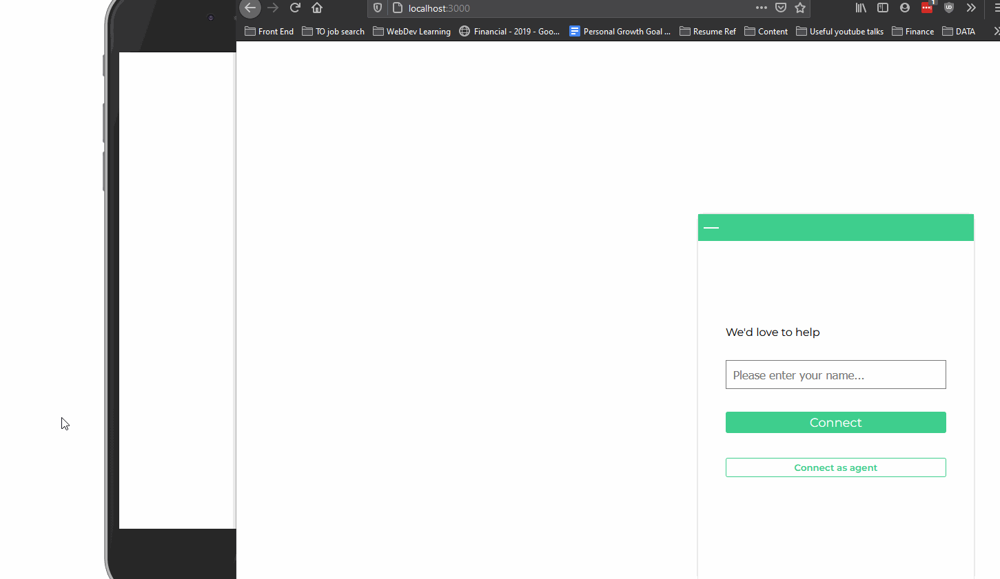
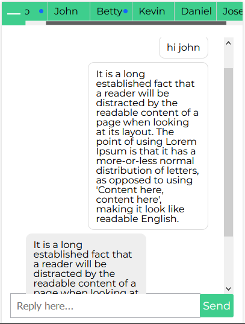

## Live chat app

#### user starts new chat by entering their name, server will connect him/her to the chat agent
#### supports multiple chats if sign on as an chat agent 
#### indicator for unread chat
#### support offline message, agent/ user will receive missed message when sign on to the app

Technologies

Express, React, ws, webpack, babel, sass, jest
